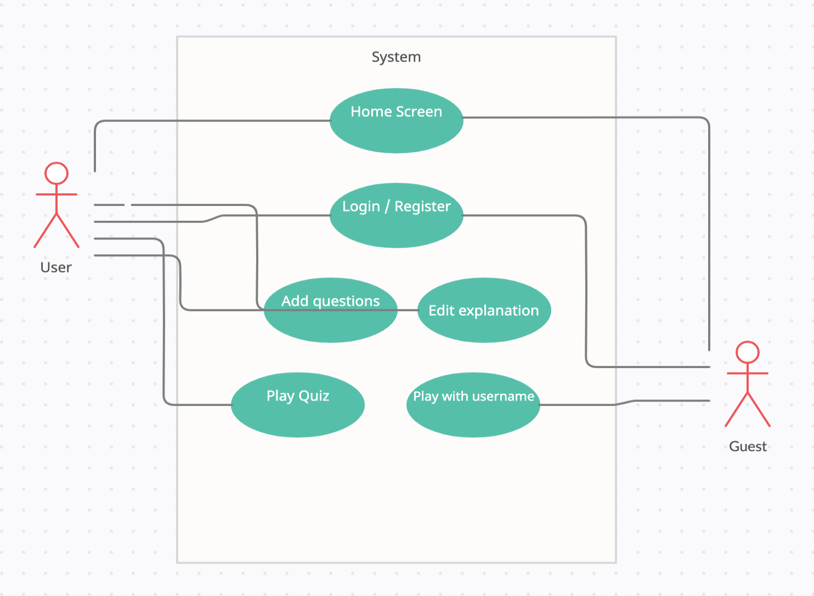
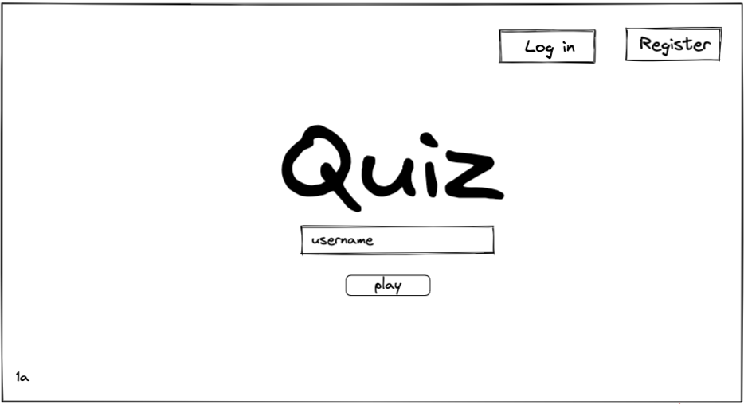
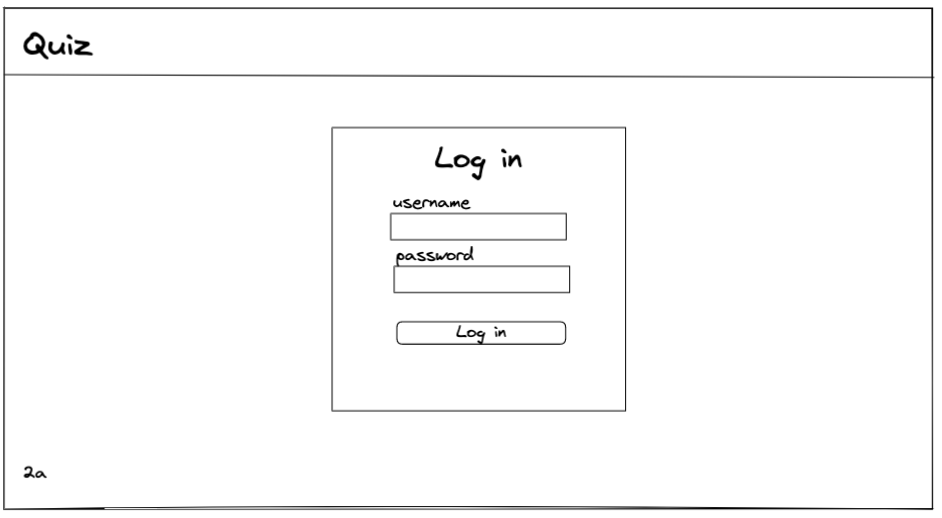
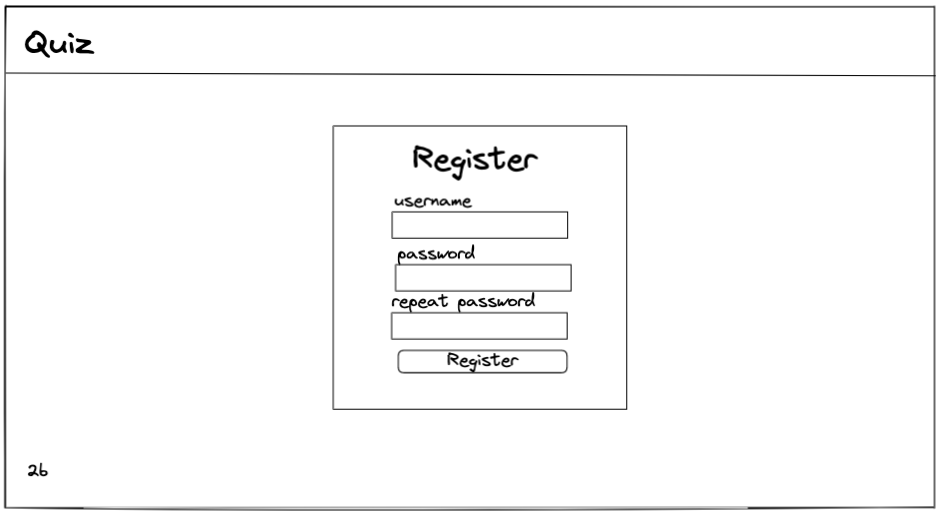
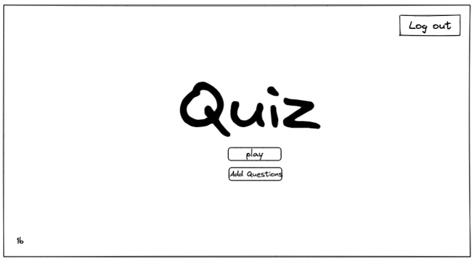
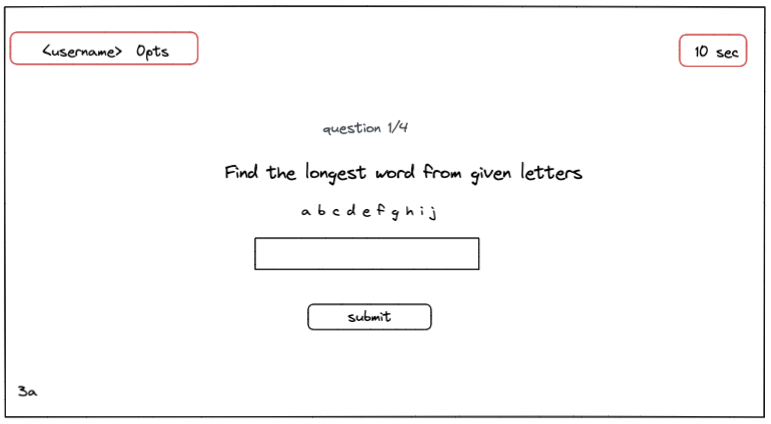
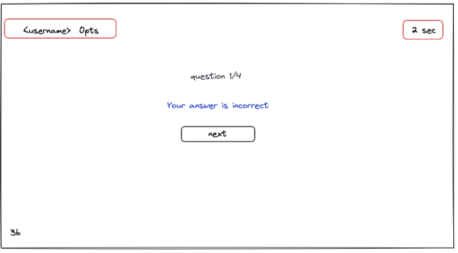
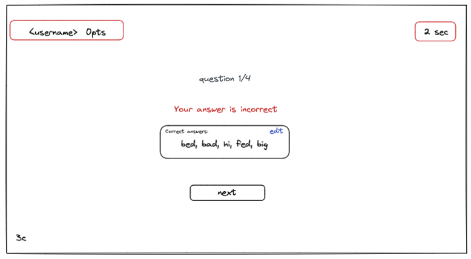
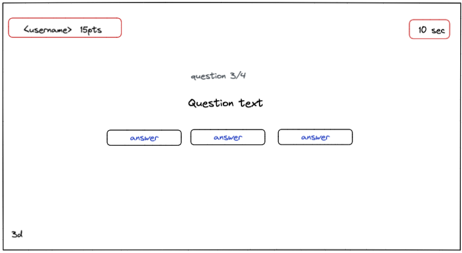
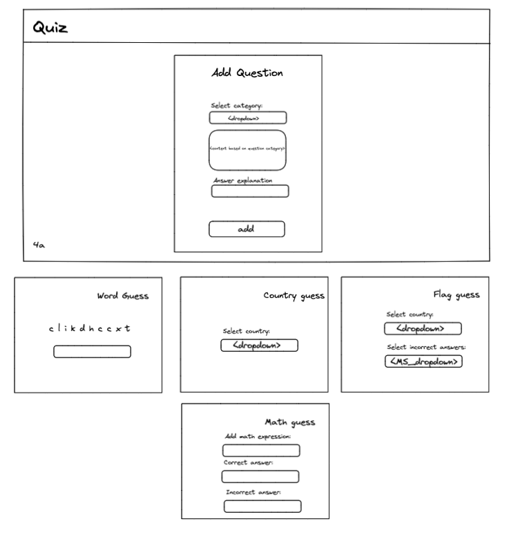

# Projektni zahtev

## Veb aplikacija za igre i kvizove

### 1. Uvod

Veb aplikacija za igre i kvizove omogućava zabavu i proveru znanja korisnika. Sistem će biti dostupan za korišćenje
svim korisnicima putem veb pregledača [1].

#### 1.1 Cilj razvoja

Upotrebom aplikacije korisnici mogu na lak i efikasan način da testiraju svoje znanje.

#### 1.2 Obim sistema

Aplikacija će biti hostovana [2] na veb serveru[3] i pristupaće joj se putem veb pregledača. Za funkcionisanje celog sistema
potrebno je obezbediti i pristup bazi podataka. Sistem ne može funkcionisati bez stalne internet konekcije.

#### 1.3 Prikaz proizvoda

Funkcionalni zahtevi aplikacije:

- Prijava i registracija korisnika
- Unos korisničkog imena za neprijavljene/neregistrovane korisnike
- Dodavanje novih pitanja i izmena sadržaja u slučaju obeleženog netačnog odgovora za prijavljene/registrovane korisnike
- Mogućnost igranje kviza za prijavljene i neprijavljene korisnike
- Prikaz ostvarenih bodova
- Onemogućavanje slanja odgovora ukoliko je vreme isteklo

Nefunkcionalni zahtevi aplikacije:

- Aplikacija treba da bude hostovana na veb serveru
- Korisnici ne mogu uticati na rad aplikacije. Podaci koji se unose kroz različite forme prolaze višestruku proveru i na
  klijentskoj i na serverskoj strani aplikacije.

#### 1.3.1 Perspektiva proizvoda

Aplikacija u narednim iteracijama moze pružiti beleženje ostvarenih rezultata koji bi bili javno vidljivi, odnosno ovo
bi omogućilo takmičarima uvid u rang listu i svoju poziciju na istoj što bi dalo podsticaj takmičarima da budu bolji i
više koriste aplikaciju.

#### 1.3.2 Funkcije proizvoda

Na dijagramu slučajeva korišćenja (slika 1) prikazane su funkcije sistema namenjene krajnjem korisniku. Detalji o tipu
korisnika su detaljnije opisani u sekciji 1 i sekciji 1.3 ovog dokumenta.



#### 1.3.3 Karakteristike korisnika

Korisnik mora da ima pristup računaru i veb pretraživaču sa stabilnom internet konekcijom.

#### 1.3.4 Ograničenja

- Baza podataka mora da bude relaciona i treba koristiti MySQL ili MariaDB sistem za upravljanje bazama podataka (RDBMS)
- Back-end i front-end delovi projekta moraju da budi pisani na TypeScript jeziku, prevedeni TypeScript prevodiocem na adekvatan JavaScript.
- Za postupak provere identiteta korisnika koji upućuje zahteve back-end delu aplikacije može da se koristi mehanizam sesija ili JWT (JSON Web Tokena), po slobodnom izboru.
- Sav generisani HTML kôd koji proizvodi front-end deo aplikacije mora da bude 100% validan, tj. da prođe proveru W3C Validatorom (dopuštena su upozorenja - Warning, ali ne i greške - Error).
- Grafički korisnički interfejs se generiše na strani klijenta (client side rendering), korišćenjem React biblioteke, dok podatke doprema asinhrono iz back-end dela aplikacije (iz API-ja).
- Front-end deo aplikacije treba da bude realizovan tako da se prilagođava različitim veličinama ekrana (responsive design).

#### 1.4 Definicije

1. Veb pregledač - (engl. web browser) poseban program čija je osnovna funkcija da omogući korisniku da pregledava web stranice, kao i sve prateće sadržaje širom globalne mreže (Interneta) [1]
2. Hostovanje - Host je bilo koji uređaj povezan u računalnu mrežu (najčešće Internet) a koji može korištenjem standardnih protokola ostvariti komunikaciju s drugim sličnim uređajima (hostovima). [2]
3. Veb server - U računarstvu, server je računarski program ili uređaj koji pruža funkcionalnost za druge programe ili uređaje koje zovemo "klijentima". [3]

### 2. Specifikacije zahteva

Registrovani i prijavljeni korisnici mogu da dodaju nova pitanja i izmene
sadržaje u slučaju obeleženog pogrešnog odgovora. Korisnik koji želi da igra kviz ne mora da se registruje, ali je potrebno
da upiše svoje korisničko ime prilikom pokretanja kviza.

Korisniku su na raspolaganju četiri različite igre:

- Prva igra koja se pokreće je generisanje reči od deset nasumično generisanih slova koju korisnik treba da upiše u tekstualno polje u roku od šezdeset sekundi. Reč treba biti što duža I za svako slovo se dobija jedan bod.

- Druga igra je pogađanje države sa zastavom. U navedenoj igri se prikaže zastava I u tekstualnom polju je potrebno da se upiše koja je država u pitanju. Korisnik ima deset sekundi vremena da pogodi koja je država u pitanju.

- Treća igra je pogađanje zastave za ime države. U navedenoj igri se prikaže naziv države I prikažu se tri ponuđene zastave. Korisnik treba da izabere koja je od navedenih zastava tačan odgovor. Korisnik ima deset sekundi vremena da pogodi koja je zastava tačan odgovor.

- Četvrta igra je pogađanje matematičkih pitanja. Korisnik ima trideset sekundi vremena da pogodi tačan odgovor. U ovoj igri korisnik bira koji je rezultat tačan za izraz koji se nalazi u pitanju.

#### 2.1 Spoljašnji interfejs

Na slici 1a prikazan je izgled početnog ekrana, klikom na Log in dugme korisnik odlazi na stranicu za login, klikom na Register dugme korisnik odlazi na stranicu za register.
Klikom na dugme play korisnik će započeti igru samo ukoliko je prethodno popunio podatke u polju username.



Na slici 2a prikazan je izgled login ekrana, ukoliko korisnik klikne log in dugme pre nego što je popunio podatke, dobiće obaveštenje da su polja Username
i Password obavezna. Ukoliko korisnik unese predugačke/prekratke parametre za korisničko ime i lozinku dobiće obaveštenje relevantno za dužinu parametara.
Ukoliko su podaci ispravni, korisnik odlazi na početni ekran sa slike 1b. Ukoliko korisnik unese pogrešnu lozinku ili nepostojeće korisničko ime dobiće odgovarajuću poruku



Na slici 2b prikazan je izgled register ekrana, validacija je slična kao i za login ekran s tim što ovde postoji dodatna validacija u pogledu
poklapanja teksta lozinke. Klikom na Register dugme, sa uslovom da su podaci validni, korisnik odlazi na početni ekran sa slike 1b.



Na slici 1b prikazan je izgled početnog ekrana za autorizovane korisnike. Klikom na dugme play korisnik odlazi na ekran za igru sa slike 3a, klikom na dugme Add Questions
korisnik odlazi na formu za dodavanje novih pitanja sa slike 4a. Klikom na Log out dugme korisnik odlazi na login ekran sa slike 2a.



Na slici 3a prikazan je izgled prvog pitanja u kvizu. Korisnik ima 60 sekundi da unese najduzu rec formiranu od ponudjenih karaktera. 
U desnom uglu može videti štopericu koja odbrojava preostale sekunde, u levom uglu može videti svoje korisničko ime i ostvarene poene.
Ukoliko korisnik unese karakter koji mu nije ponuđen ispisaće se odgovarajuća poruka i neće biti u mogućnost da pošalje odgovor. 
Ukoliko vreme istekne, korisnik dobija odgovarajuću poruku i mogućnost da pređe na sledeće pitanje, ukoliko to nije poslednje pitanje. 
U slučaju poslednjeg pitanja klikom na dugme korisnik završava kviz. Klikom na submit dugme, u slučaju tačnog odgovora korisnik odlazi na ekran sa slike 3b u suprotnom prikazuje mu se ekran sa slike 3c



Na slici 3b prikazan je izgled povratne informacije u slučaju da je korisnik tačno odgovorio na pitanje, klikom na dugme next odlazi na sledeće pitanje u slučaju da to nije poslednje pitanje, ukoliko je upravo odgovoreno na poslednje pitanje korisnik klikom na dugme završava kviz.



Na slici 3c prikazan je izgled povratne informacije u slucaju da je korisnik netacno odgovorio na pitanje. Korisnik moze videti objasnjenje odgovora, ukoliko je korisnik autentifikovan bice u mogucnosti da izmeni ovo objasnjenje klikom na edit ikonicu. Ponasanje nakon klika na dugme next opisano je u prethodnim scenarijima. 



Na slici 3d prikazan je izgled pitanja koja sadrže više ponuđenih odgovora, razlika u odnosu na tip pitanja gde takmičar treba da unese odgovor je ta da korisnik klikom na izabrani odgovor direktno i odgovara na pitanje. Ponašanje aplikacije nakon odgovora ostaje nepromenjeno i objašnjeno je u prethodnim scenarijima.



Na slici 4a prikazan je izgled forme za dodavanje novih pitanja. Korisnik prvo bira željenu kategoriju pitanja, na osnovu izabrane kategorije deo forme se dinamički menja i to na sledeći način:
* Pogađanje slova, korisnik dobija 10 nasumično generisanih slova, klikom na ikonicu pored ima mogućnost da opet generiše novih 10 slova, u nastavku može uneti tačne odgovore ali se oni moraju sastojati od ponuđenih karaktera, u suprotnom dobija obaveštenje da to nije učinio.
* Pogađanje imena države na osnovu zastave, korisnik bira zemlju iz liste zemalja, tačan odgovor je ekvivalentan izabranoj zemlji tako da nema potrebe za dodatnim poljem.
* Pogađanje zastave na osnovu imena države, korisnik bira zemlju iz liste zemalja, korisnik zatim iz multiselect dropdown liste bira zemlje čije ce zastave predstavljati netačne odgovore, u ovoj listi se ne sme naći zemlja koja je izabrana kao pitanje i ne sme se naći više od dva netačna odgovora
* Pogađanje vrednosti matematičkog izraza, korisnik unosi validan matematički izraz, korisnik unosi tacan odgovor, korisnik unosi netačne odgovore razdvojene zarezom

Na kraju, korisnik mora uneti objašnjenje u slučaju netačnog odgovora, sva pitanja moraju zadovoljiti odgovarajuću validaciju da bi pitanje bilo dodato.



#### 2.2 Funkcije

U okviru sistema postoje dve role, prijavljeni korisnik i posetilac, ovlascenja po roli prikazana su u sekciji [1.3.2](#1.3.2-Funkcije-proizvoda)

#### 2.3 Pogodnosti za upotrebu

Sistem je realizovan kao veb aplikacija sto mu omogucava da bude lako dostupan i upotrebljiv.

#### 2.4 Zahtevane performanse

Sistem ne vrši kompleksne obrade podataka te je vrlo performantan, u slučaju slabije konekcije korisniku se prikazuje
sadržaj koji ima svrhu da ga animira dok čeka na prikaz interfejsa.

#### 2.5 Zahtevi baze podataka

Model baze podataka sa tipovima podataka i obelezenim primarnim i stranim kljucevima dostupan je u datoteci pod nazivom [db-model.png](../02-resources/db-model.png)

Konvencija imenovanja po tabelama se može videti u nastavku:
```sql
--
-- Table structure for table `category`
--

DROP TABLE IF EXISTS `category`;
/*!40101 SET @saved_cs_client     = @@character_set_client */;
/*!40101 SET character_set_client = utf8 */;
CREATE TABLE `category` (
  `category_id` int(10) unsigned NOT NULL AUTO_INCREMENT,
  `category_name` varchar(100) COLLATE utf8mb4_unicode_ci NOT NULL,
  `category_timer` int(11) NOT NULL,
  PRIMARY KEY (`category_id`)
) ENGINE=InnoDB AUTO_INCREMENT=5 DEFAULT CHARSET=utf8mb4 COLLATE=utf8mb4_unicode_ci;

--
-- Table structure for table `question`
--

DROP TABLE IF EXISTS `question`;
/*!40101 SET @saved_cs_client     = @@character_set_client */;
/*!40101 SET character_set_client = utf8 */;
CREATE TABLE `question` (
  `question_id` int(10) unsigned NOT NULL AUTO_INCREMENT,
  `question` varchar(100) COLLATE utf8mb4_unicode_ci NOT NULL,
  `category_id` int(10) unsigned NOT NULL,
  PRIMARY KEY (`question_id`),
  KEY `fk_question_category_id` (`category_id`),
  CONSTRAINT `question_FK` FOREIGN KEY (`category_id`) REFERENCES `category` (`category_id`) ON UPDATE CASCADE
) ENGINE=InnoDB AUTO_INCREMENT=18 DEFAULT CHARSET=utf8mb4 COLLATE=utf8mb4_unicode_ci;

--
-- Table structure for table `user`
--

DROP TABLE IF EXISTS `user`;
/*!40101 SET @saved_cs_client     = @@character_set_client */;
/*!40101 SET character_set_client = utf8 */;
CREATE TABLE `user` (
  `user_id` int(10) unsigned NOT NULL AUTO_INCREMENT,
  `username` varchar(64) COLLATE utf8mb4_unicode_ci NOT NULL,
  `password_hash` varchar(255) COLLATE utf8mb4_unicode_ci NOT NULL,
  `score` int(11) NOT NULL DEFAULT 0,
  PRIMARY KEY (`user_id`),
  UNIQUE KEY `uq_user_username` (`username`) USING BTREE
) ENGINE=InnoDB AUTO_INCREMENT=8 DEFAULT CHARSET=utf8mb4 COLLATE=utf8mb4_unicode_ci;

--
-- Table structure for table `answer`
--

DROP TABLE IF EXISTS `answer`;
/*!40101 SET @saved_cs_client     = @@character_set_client */;
/*!40101 SET character_set_client = utf8 */;
CREATE TABLE `answer` (
  `answer_id` int(10) unsigned NOT NULL AUTO_INCREMENT,
  `answer` varchar(100) COLLATE utf8mb4_unicode_ci NOT NULL,
  `question_id` int(10) unsigned NOT NULL,
  `is_correct` tinyint(1) unsigned NOT NULL,
  PRIMARY KEY (`answer_id`),
  KEY `fk_answer_question_id` (`question_id`),
  CONSTRAINT `answer_FK` FOREIGN KEY (`question_id`) REFERENCES `question` (`question_id`) ON UPDATE CASCADE
) ENGINE=InnoDB AUTO_INCREMENT=50 DEFAULT CHARSET=utf8mb4 COLLATE=utf8mb4_unicode_ci;

--
-- Table structure for table `answer_explanation`
--

DROP TABLE IF EXISTS `answer_explanation`;
/*!40101 SET @saved_cs_client     = @@character_set_client */;
/*!40101 SET character_set_client = utf8 */;
CREATE TABLE `answer_explanation` (
  `answer_explanation` varchar(100) COLLATE utf8mb4_unicode_ci NOT NULL,
  `question_id` int(10) unsigned NOT NULL,
  UNIQUE KEY `fk_answer_explanation_question_id` (`question_id`) USING BTREE,
  CONSTRAINT `answer_explanation_FK` FOREIGN KEY (`question_id`) REFERENCES `question` (`question_id`) ON UPDATE CASCADE
) ENGINE=InnoDB DEFAULT CHARSET=utf8mb4 COLLATE=utf8mb4_unicode_ci;

```

#### 2.6 Projektna ograničenja

Ograničenja su navedena u sekciji [1.3.4](#134-Ograničenja)

#### 2.7 Sistemske karakteristike softvera

Zbog prirode tehnologija koje su korišćene pri pravljenju sistema on zahteva korišćenje modernih operativnih sistema i veb pretraživača

#### 2.8 Dopunske informacije

U direktorijumu 02-resources/ nalazi se dump baze podataka sa inicijalnim parametrima potrebnim za pokretanje sistema.
Kredencijali vec registrovanog korisnika su:
username: vsimonovski
pass: test123
